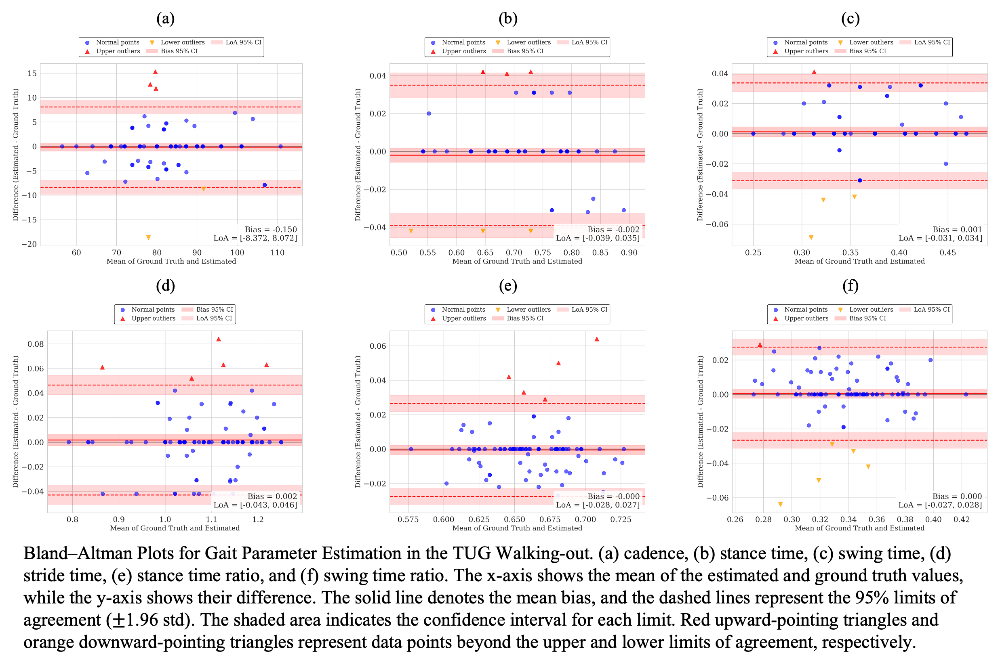

# Supplementary Materials for the paper
**"Low‑Resolution Thermal Imaging for Clinical Gait Assessment: Multi‑Task Transformer Model for TUG and Gait Phase Analysis"**

> This page hosts high‑resolution figures and additional analyses that could not fit in the main paper due to space limits.

---

## Additional Results

This section presents the correlation plots (regression lines) and Bland-Altman plots for the predicted vs. actual durations of the three subtasks of the Timed Up and Go (TUG) test: Walking-out, Turning, and Walking-in.

### Walking-out Phase

| Correlation Plot | Bland-Altman Plot |
| :---: | :---: |
|  |  |

### Turning Phase

| Correlation Plot | Bland-Altman Plot |
| :---: | :---: |
|  |  |

### Walking-in Phase

| Correlation Plot | Bland-Altman Plot |
| :---: | :---: |
|  |  |