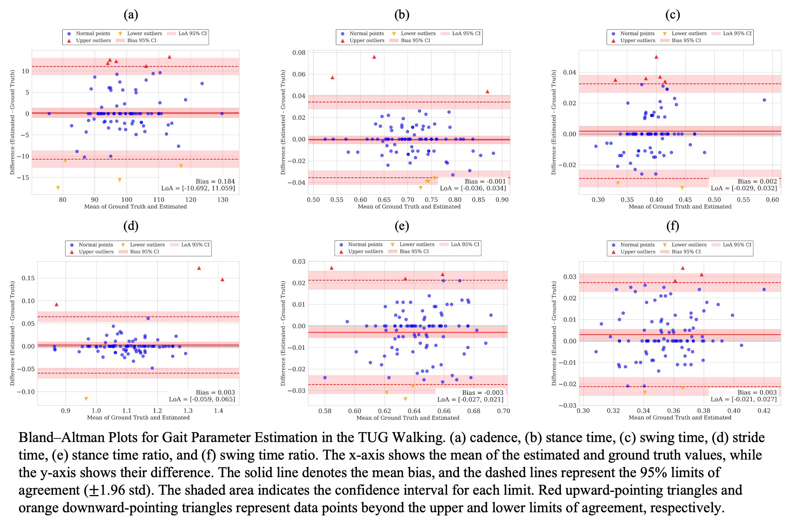

# Supplementary Materials for the paper
**"Low‑Resolution Thermal Imaging for Clinical Gait Assessment: Multi‑Task Transformer Model for TUG and Gait Phase Analysis"**

> This page hosts high‑resolution figures and additional analyses that could not fit in the main paper due to space limits.

---

## Additional Results

This section presents the correlation plots (regression lines) and Bland-Altman plots for the predicted vs. actual durations of the TUG test and its three main gait phases: Walking-out, Turning, and Walking-in.

### Walking Phase

**Correlation Plot**

**Bland-Altman Plot**

---

### Walking-out Phase

**Correlation Plot**

**Bland-Altman Plot**

---

### Turning Phase

**Correlation Plot**

**Bland-Altman Plot**

---

### Walking-in Phase

**Correlation Plot**

**Bland-Altman Plot**

